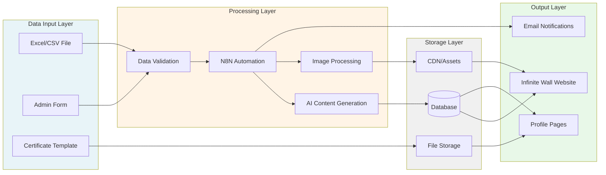
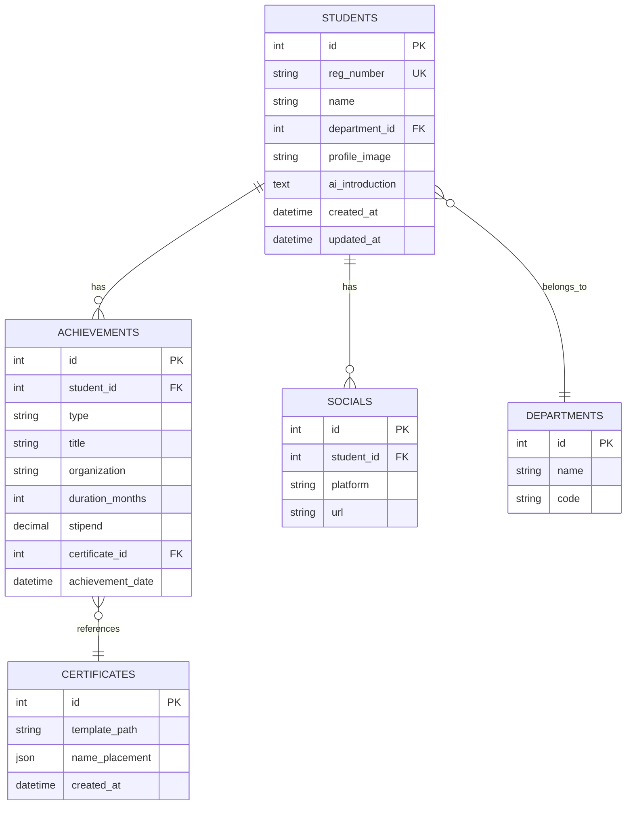
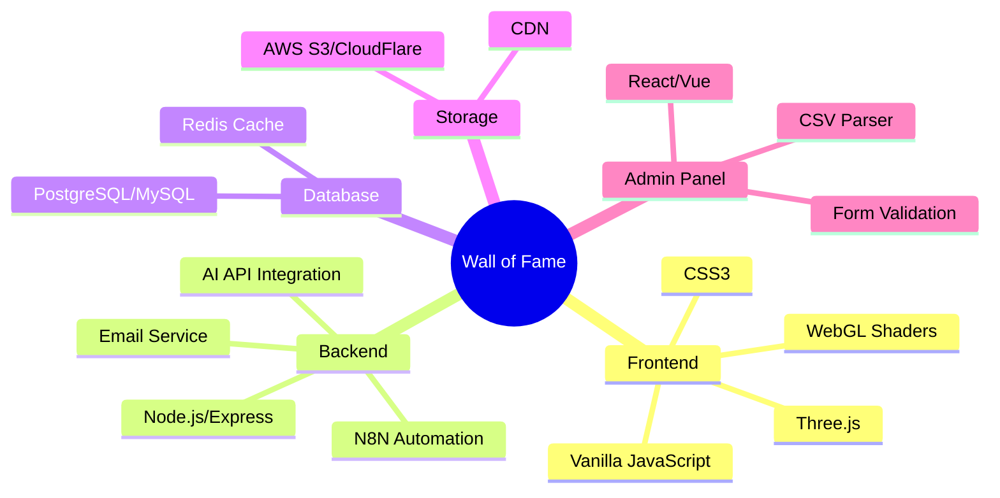
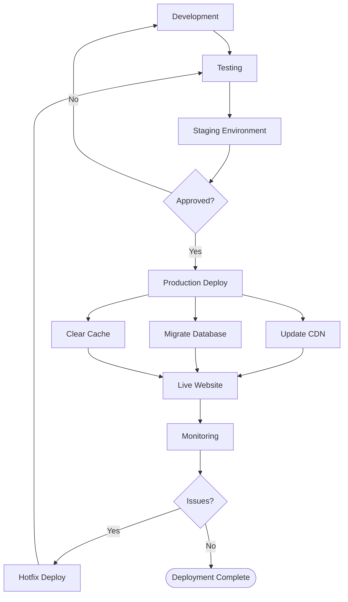
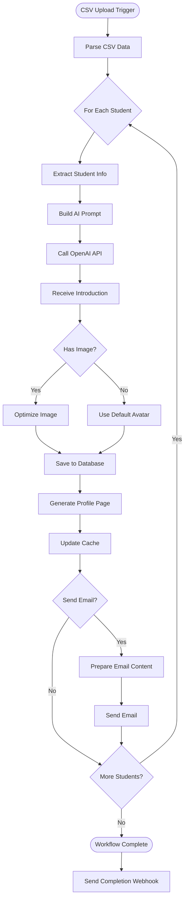

# Wall of Fame - System Architecture Flowchart

## Complete System Flow

```mermaid
flowchart TD
    Start([Wall of Fame System]) --> UserType{User Type?}
    
    %% VIEWER FLOW
    UserType -->|Viewer/Student| ViewerEntry[Enter Infinite Wall]
    ViewerEntry --> ViewerInteract[Drag & Browse Grid]
    ViewerInteract --> ViewerSelect[Click on Student Card]
    ViewerSelect --> ViewerProfile[View Profile Page]
    ViewerProfile --> ViewerDetails[See Achievement Details]
    ViewerDetails --> ViewerActions{Choose Action}
    ViewerActions -->|View Certificate| Certificate[Open College Certificate]
    ViewerActions -->|Visit Social| Social[Open LinkedIn/Website]
    ViewerActions -->|Continue Browsing| ViewerInteract
    ViewerActions -->|Exit| ViewerEnd([End Session])
    
    %% ADMIN/TEACHER FLOW
    UserType -->|Admin/Teacher| AdminLogin[Login to Admin Panel]
    AdminLogin --> FirstTime{First Time Setup?}
    
    %% FIRST TIME SETUP
    FirstTime -->|Yes| SetupDept[Add Department Details]
    SetupDept --> SetupCert[Upload Certificate Template]
    SetupCert --> SetupFields[Select Name Placement Fields]
    SetupFields --> SetupComplete[Setup Complete]
    SetupComplete --> AdminDashboard[Admin Dashboard]
    
    %% REGULAR ADMIN FLOW
    FirstTime -->|No| AdminDashboard
    AdminDashboard --> AdminAction{Choose Action}
    
    %% UPLOAD NEW DATA
    AdminAction -->|Upload Data| UploadFile[Upload Excel/CSV File]
    UploadFile --> ValidateData{Data Valid?}
    ValidateData -->|No| ErrorMsg[Show Error Message]
    ErrorMsg --> UploadFile
    ValidateData -->|Yes| ProcessData[Process Student Data]
    ProcessData --> N8NScript[N8N Script Execution]
    N8NScript --> GenerateIntro[Generate AI Introduction]
    GenerateIntro --> CreateProfiles[Create Profile Pages]
    CreateProfiles --> EmailPrompt{Send Emails?}
    
    %% EMAIL FLOW
    EmailPrompt -->|Yes| EmailOptions{Email Recipients}
    EmailOptions -->|All College| SendAllEmails[Send to All College Emails]
    EmailOptions -->|Selected List| SendSelectedEmails[Send to Selected Recipients]
    SendAllEmails --> EmailSent[Emails Sent Successfully]
    SendSelectedEmails --> EmailSent
    EmailSent --> UpdateComplete[Data Upload Complete]
    
    EmailPrompt -->|No| UpdateComplete
    UpdateComplete --> AdminDashboard
    
    %% UPDATE EXISTING DATA
    AdminAction -->|Update/Modify| SelectStudent[Select Student Record]
    SelectStudent --> ModifyData[Edit Student Details]
    ModifyData --> SaveChanges[Save Changes]
    SaveChanges --> RegenerateIntro[Regenerate Introduction]
    RegenerateIntro --> UpdateProfile[Update Profile Page]
    UpdateProfile --> UpdateSuccess[Update Complete]
    UpdateSuccess --> AdminDashboard
    
    %% VIEW ANALYTICS
    AdminAction -->|View Analytics| Analytics[View Dashboard Analytics]
    Analytics --> AnalyticsData[Views, Clicks, Engagement]
    AnalyticsData --> AdminDashboard
    
    %% LOGOUT
    AdminAction -->|Logout| AdminLogout([Logout])
    
    %% STYLING
    classDef viewerClass fill:#4A90E2,stroke:#2E5C8A,stroke-width:2px,color:#fff
    classDef adminClass fill:#E24A4A,stroke:#8A2E2E,stroke-width:2px,color:#fff
    classDef processClass fill:#50C878,stroke:#2E8A4A,stroke-width:2px,color:#fff
    classDef decisionClass fill:#FFB84D,stroke:#CC8A3D,stroke-width:2px,color:#000
    
    class ViewerEntry,ViewerInteract,ViewerSelect,ViewerProfile,ViewerDetails,Certificate,Social viewerClass
    class AdminLogin,AdminDashboard,SetupDept,SetupCert,SetupFields,UploadFile,SelectStudent,ModifyData,Analytics adminClass
    class ProcessData,N8NScript,GenerateIntro,CreateProfiles,SaveChanges,RegenerateIntro,UpdateProfile processClass
    class UserType,FirstTime,ValidateData,EmailPrompt,EmailOptions,ViewerActions,AdminAction decisionClass
```

---

## Data Flow Architecture

---

## Database Schema

---

## Technology Stack

---

## Deployment Flow

---

## N8N Workflow Detail

</content>
</invoke>